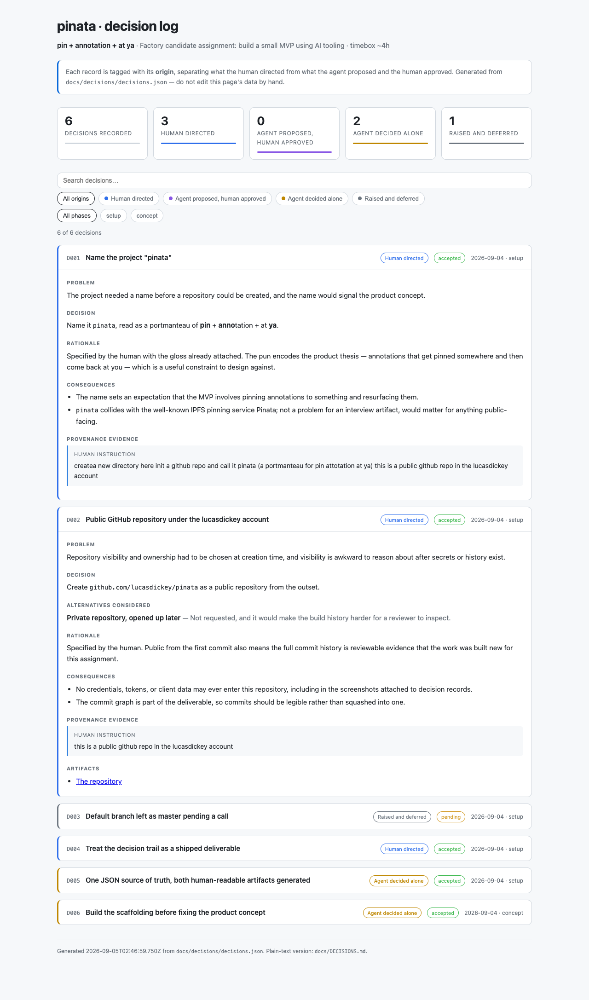

<!-- GENERATED FILE. Do not edit.
     Source: docs/decisions/decisions.json
     Regenerate: npm run docs -->

# Decision log

**pinata** — pin + annotation + at ya  
Factory candidate assignment: build a small MVP using AI tooling  
Timebox: ~4h

Every record is tagged with its **origin**, which separates what the human
directed from what the agent proposed and the human approved. See `AGENTS.md`
section 2.3 for the taxonomy and the evidence each origin requires.

## Provenance at a glance

| Origin | Count | Decisions |
| --- | --: | --- |
| Human directed | 7 | D001, D002, D004, D007, D011, D012, D013 |
| Agent proposed, human approved | 9 | D009, D010, D014, D015, D016, D017, D018, D019, D020 |
| Agent decided alone | 10 | D005, D006, D008, D021, D022, D023, D024, D025, D026, D027 |
| Raised and deferred | 1 | D003 |
| **Total** | **27** | |

## Index

| ID | Phase | Decision | Origin | Status |
| --- | --- | --- | --- | --- |
| [D001](#d001--name-the-project-pinata) | setup | Name the project "pinata" | Human directed | accepted |
| [D002](#d002--public-github-repository-under-the-lucasdickey-account) | setup | Public GitHub repository under the lucasdickey account | Human directed | accepted |
| [D003](#d003--default-branch-left-as-master-pending-a-call) | setup | Default branch left as master pending a call | Raised and deferred | superseded |
| [D004](#d004--treat-the-decision-trail-as-a-shipped-deliverable) | setup | Treat the decision trail as a shipped deliverable | Human directed | accepted |
| [D005](#d005--one-json-source-of-truth-both-human-readable-artifacts-generated) | setup | One JSON source of truth, both human-readable artifacts generated | Agent decided alone | accepted |
| [D006](#d006--build-the-scaffolding-before-fixing-the-product-concept) | concept | Build the scaffolding before fixing the product concept | Agent decided alone | accepted |
| [D007](#d007--one-command-is-the-quality-gate-npm-run-validate) | validate | One command is the quality gate: npm run validate | Human directed | accepted |
| [D008](#d008--test-the-provenance-rules-not-just-the-code-that-renders-them) | validate | Test the provenance rules, not just the code that renders them | Agent decided alone | accepted |
| [D009](#d009--rename-the-default-branch-to-main) | setup | Rename the default branch to main | Agent proposed, human approved | accepted |
| [D010](#d010--commit-straight-to-main-with-ci-as-the-only-gate) | setup | Commit straight to main, with CI as the only gate | Agent proposed, human approved | accepted |
| [D011](#d011--commit-and-push-early-and-often-especially-at-decision-points) | setup | Commit and push early and often, especially at decision points | Human directed | accepted |
| [D012](#d012--define-the-product-directional-feedback-on-friends-public-websites) | concept | Define the product: directional feedback on friends' public websites | Human directed | accepted |
| [D013](#d013--chickpea-is-the-canonical-real-world-test-target) | concept | Chickpea is the canonical real-world test target | Human directed | accepted |
| [D014](#d014--nextjs--react--typescript-on-vercel-is-the-application-stack) | design | Next.js + React + TypeScript on Vercel is the application stack | Agent proposed, human approved | accepted |
| [D015](#d015--mit-react-flow-is-the-canvas-foundation) | design | MIT React Flow is the canvas foundation | Agent proposed, human approved | accepted |
| [D016](#d016--browserless-captures-screenshots-and-dom-manifests-in-one-session) | design | Browserless captures screenshots and DOM manifests in one session | Agent proposed, human approved | accepted |
| [D017](#d017--private-vercel-blob-for-images-tursolibsql--drizzle-for-metadata) | design | Private Vercel Blob for images, Turso/libSQL + Drizzle for metadata | Agent proposed, human approved | accepted |
| [D018](#d018--editor-password-prompt-persistent-founder-capability-links-append-only-threads) | design | Editor password prompt, persistent founder capability links, append-only threads | Agent proposed, human approved | accepted |
| [D019](#d019--standardize-on-node-24-across-app-ci-and-vercel) | setup | Standardize on Node 24 across app, CI, and Vercel | Agent proposed, human approved | accepted |
| [D020](#d020--product-stack-transition-vitest-and-playwright-join-the-single-validate-gate) | validate | Product-stack transition: Vitest and Playwright join the single validate gate | Agent proposed, human approved | accepted |
| [D021](#d021--re-scope-the-dependency-ban-to-an-approved-pinned-allowlist-eslint-covers-js-tsc-covers-ts) | build | Re-scope the dependency ban to an approved pinned allowlist; ESLint covers JS, tsc covers TS | Agent decided alone | accepted |
| [D022](#d022--serve-reqs-from-repository-sources-with-a-zero-dependency-safe-markdown-renderer) | build | Serve /reqs from repository sources with a zero-dependency safe Markdown renderer | Agent decided alone | accepted |
| [D023](#d023--publish-one-versioned-validation-boundary-catalog-as-shared-exported-constants) | build | Publish one versioned validation boundary catalog as shared exported constants | Agent decided alone | accepted |
| [D024](#d024--verify-the-editor-password-via-fixed-length-digests-and-bind-sessions-to-a-double-submit-csrf-proof) | build | Verify the editor password via fixed-length digests and bind sessions to a double-submit CSRF proof | Agent decided alone | accepted |
| [D025](#d025--persist-the-canonical-model-in-committed-drizzle-migrations-with-database-enforced-thread-immutability-and-injectable-provider-seams) | build | Persist the canonical model in committed Drizzle migrations with database-enforced thread immutability and injectable provider seams | Agent decided alone | accepted |
| [D026](#d026--throttle-editor-logins-with-one-durable-digested-global-bucket-and-check-secrets-fail-closed-before-verification) | build | Throttle editor logins with one durable digested global bucket and check secrets fail-closed before verification | Agent decided alone | accepted |
| [D027](#d027--env-dependent-tests-skip-rather-than-fail-so-the-ci-gate-needs-no-repository-secrets) | build | Env-dependent tests skip rather than fail, so the CI gate needs no repository secrets | Agent decided alone | accepted |

---

## D001 — Name the project "pinata"

*2026-09-04 · phase: setup · origin: **Human directed** · status: **accepted***

**Problem**

The project needed a name before a repository could be created, and the name would signal the product concept.

**Decision**

Name it `pinata`, read as a portmanteau of **pin** + **anno**tation + at **ya**.

**Rationale**

Specified by the human with the gloss already attached. The pun encodes the product thesis — annotations that get pinned somewhere and then come back at you — which is a useful constraint to design against.

**Consequences**

- The name sets an expectation that the MVP involves pinning annotations to something and resurfacing them.
- `pinata` collides with the well-known IPFS pinning service Pinata; not a problem for an interview artifact, would matter for anything public-facing.

**Provenance evidence**

Human instruction:

> createa new directory here init a github repo and call it pinata (a portmanteau for pin attotation at ya) this is a public github repo in the lucasdickey account

---

## D002 — Public GitHub repository under the lucasdickey account

*2026-09-04 · phase: setup · origin: **Human directed** · status: **accepted***

**Problem**

Repository visibility and ownership had to be chosen at creation time, and visibility is awkward to reason about after secrets or history exist.

**Decision**

Create `github.com/lucasdickey/pinata` as a public repository from the outset.

**Alternatives considered**

- *Private repository, opened up later* — Not requested, and it would make the build history harder for a reviewer to inspect.

**Rationale**

Specified by the human. Public from the first commit also means the full commit history is reviewable evidence that the work was built new for this assignment.

**Consequences**

- No credentials, tokens, or client data may ever enter this repository, including in the screenshots attached to decision records.
- The commit graph is part of the deliverable, so commits should be legible rather than squashed into one.

**Provenance evidence**

Human instruction:

> this is a public github repo in the lucasdickey account

**Artifacts**

- [The repository](https://github.com/lucasdickey/pinata)

---

## D003 — Default branch left as master pending a call

*2026-09-04 · phase: setup · origin: **Raised and deferred** · status: **superseded***
*Superseded by D009.*

**Problem**

The local git config defaults to `master`, so the pushed repository has `master` as its default branch. Renaming is trivial now and annoying once branches and CI exist.

**Decision**

Left as `master` for the moment. Flagged to the human rather than renamed silently.

**Alternatives considered**

- *Rename to `main` unilaterally* — Cosmetic but visible on a repository that will be reviewed by others; not the agent's call to make without asking.

**Rationale**

A one-word question is cheaper than an unrequested change to something the human will see in the GitHub UI.

**Consequences**

- If this is left as `master`, any CI configuration and branch protection must reference `master` consistently.

**Provenance evidence**

Agent asked:

> One note: your local git defaults to `master`, so that's the default branch on GitHub. Say the word if you want it renamed to `main`.

---

## D004 — Treat the decision trail as a shipped deliverable

*2026-09-04 · phase: setup · origin: **Human directed** · status: **accepted***

**Problem**

The assignment is graded partly on "ability to explain your process and decisions." Reconstructing that narrative at the end of a four-hour build produces a sanitized story that omits the reversals, which are the interesting part.

**Decision**

Document decisions continuously as the build proceeds, in three forms: agent rules encoded in `AGENTS.md`, a plain-text Markdown log for reading afterwards, and an HTML dashboard that opens in a browser and can carry screenshots. Each decision is explicitly tagged with whether the human requested it or the agent proposed it and the human approved.

**Alternatives considered**

- *Write a retrospective at the end of the build* — Hindsight flattens the trail. Dead ends get quietly dropped and every choice looks inevitable.
- *Rely on the git log and the Factory session transcript* — Both record what happened but not why, and neither distinguishes a human instruction from an agent suggestion that was rubber-stamped.

**Rationale**

Requested by the human. The provenance split is the load-bearing part: it makes the division of labor between human and agent auditable instead of asserted, which is precisely what an agent-driven-development interview is probing.

**Consequences**

- Documentation upkeep consumes part of the 4-hour timebox and must be counted honestly in the session log.
- Every material choice from here forward carries a small logging tax.
- The agent must ask for approval more explicitly than usual, because approvals are now evidence.

**Provenance evidence**

Human instruction:

> We will be performing the exercise request within, but I want us to set our project work up to reflect the ultimate outcome being requested. Let's document our work as I go. Let's identify decisions that we made that were critical as we go. In particular, let's identify those that I requested versus those that I approved that you asked for approval on. Set up our agents.md file or our Claude.md file to reflect that this is what we want and that we want something like a plain text Markdown file to review afterwards. I also like the idea of us constructing an HTML file that loads in the browser and shows decisions as we progress, and this can include helpful screenshots as well.

**Artifacts**

-  — The dashboard on first render: provenance counters across the top, origin and phase filters, two records expanded
- `AGENTS.md` — The protocol the agent is now bound by

---

## D005 — One JSON source of truth, both human-readable artifacts generated

*2026-09-04 · phase: setup · origin: **Agent decided alone** · status: **accepted***

**Problem**

The human asked for two views of the same decision trail: a Markdown file and an HTML dashboard. Maintaining both by hand guarantees they drift, and drift in the artifact that is supposed to prove rigor is worse than having one view.

**Decision**

Hand-edit `docs/decisions/decisions.json` only. Generate `docs/DECISIONS.md` and `docs/dashboard/decisions-data.js` from it with `node scripts/build-docs.mjs`. Ship the dashboard as a static page that reads a generated JS data island so it opens over `file://` with no server and no dependencies.

**Alternatives considered**

- *Hand-write DECISIONS.md and have the dashboard parse the Markdown* — Markdown parsing in the browser needs a dependency, and freeform prose is a fragile schema for the provenance tagging that is the whole point.
- *Have the dashboard `fetch()` decisions.json directly* — Browsers block `fetch` against `file://` origins, so the page would require a local web server. A reviewer should be able to double-click the file.
- *Static site generator* — Dependency install, build step, and lock file, all to render roughly twenty records inside a four-hour timebox.

**Rationale**

Chosen unilaterally because it is an implementation detail of a deliverable the human had already specified, it is fully reversible, and it adds no dependencies. Labeling it `agent-autonomous` rather than approved is the honest call: the human asked for the two artifacts, not for this mechanism.

**Consequences**

- `docs/DECISIONS.md` and `docs/dashboard/decisions-data.js` must never be hand-edited.
- The generator has to be run before every commit or the repository ships stale docs.
- A malformed `decisions.json` breaks both views at once, so the generator validates required fields and fails loudly.

**Artifacts**

- `scripts/build-docs.mjs` — The generator

---

## D006 — Build the scaffolding before fixing the product concept

*2026-09-04 · phase: concept · origin: **Agent decided alone** · status: **accepted***

**Problem**

The human asked to get the holistic structure in place and then start building, but the product concept was not yet stated beyond what the name implies. Guessing the concept risked building the wrong thing; waiting risked burning the turn on nothing.

**Decision**

Build the documentation apparatus first, deliberately concept-agnostic, and surface the product-direction question for the human to answer before any application code is written.

**Alternatives considered**

- *Infer the concept from the name and start building* — "Pinned annotations" admits several very different products. Building the wrong one costs more than one question does, against a 4-hour budget.
- *Ask first and build nothing this turn* — The scaffolding was already fully specified and does not depend on the concept, so it was free to do in parallel.

**Rationale**

The scaffolding has no coupling to the product, so doing it first is pure parallelism. The concept question is the one place where a wrong guess is expensive, so it is the one place worth blocking on.

**Consequences**

- `src/` stays empty until the concept is settled.
- The first product decision record will be `user-directed` or `agent-proposed-user-approved`, never `agent-autonomous`.

**Provenance evidence**

Human instruction:

> Once we have our holistic structure placed together, let's go ahead and get started.

---

## D007 — One command is the quality gate: npm run validate

*2026-09-04 · phase: validate · origin: **Human directed** · status: **accepted***

**Problem**

Factory refused to start a Mission here, warning that the folder was not a git repository and that Missions need strong validation capability or they will incorrectly infer how to QA the application. Two separate faults sat behind one warning. First, `/missions` was being run from `~/Documents/code`, which is a plain directory, while the actual repository is the `pinata` subdirectory. Second, and more seriously, the project genuinely had no way to tell a good change from a bad one: no tests, no lint, no build, nothing an autonomous agent could run to check its own work.

**Decision**

Run Missions from inside `pinata/`, and give the repository a real validation contract before any Mission touches it. `npm run validate` is the single gate, chaining `lint` then `docs:check` then `test`. It is documented in `AGENTS.md` section 3 as the authoritative answer to "how do I know a change is good?", and CI runs the identical command so local green and CI green mean the same thing.

**Alternatives considered**

- *Proceed and accept the warning's risk* — The warning is accurate. An agent with no validation signal optimizes for looking finished, and the failure surfaces later as confidently broken output.
- *Add a test framework such as Vitest or Jest* — Node 20 ships `node:test`, which covers this need exactly. A framework would break the zero-dependency rule that keeps the docs artifacts working with no install step.
- *Wait until product code exists before adding tests* — The documentation apparatus is already the largest thing in the repo and is itself a graded deliverable. It needed covering regardless, and having the gate in place first means product code inherits it.
- *Init a git repo in the parent directory to silence the warning* — That directory holds dozens of unrelated projects. It would hand a Mission a working tree of other people's work to reason about.

**Rationale**

Requested by the human as an explicit precondition to running a Mission. The design principle chosen inside that request: validation has to be one command, dependency-free, and deterministic, because a gate that is slow, flaky, or awkward to run does not get run. Determinism specifically forced generated artifacts to embed a source hash rather than a wall-clock timestamp, since otherwise every build differs from the last and a staleness check can never pass.

**Consequences**

- `npm run validate` must pass before any work is called finished, by a human or an agent.
- Generated output must stay a pure function of `decisions.json`; no timestamps, no environment-dependent content.
- Product code landing in `src/` adds its tests to the same `test/` directory rather than introducing a second runner.
- The test suite is now load-bearing documentation: it encodes the provenance rules from `AGENTS.md` 2.3 as executable assertions, so the protocol cannot quietly rot.
- Missions must be launched from `pinata/`, not from the parent directory.

**Provenance evidence**

Human instruction:

> let's do this first before we run /missions: You are about to run a Mission on a folder that is not a git repository, so we cannot evaluate its agent readiness. Missions can only run effectively when there are strong validation capabilities built into the project. By proceeding, you are claiming that these capabilities exist or taking the risk that the Mission will incorrectly infer how to QA your application.

**Artifacts**

- `AGENTS.md` — Section 3 states the validation contract a Mission should read
- `.github/workflows/validate.yml` — CI runs the same single command

---

## D008 — Test the provenance rules, not just the code that renders them

*2026-09-04 · phase: validate · origin: **Agent decided alone** · status: **accepted***

**Problem**

The decision log's value rests entirely on the provenance tags being trustworthy. Nothing stopped a future agent, including me, from tagging a choice `user-directed` with no quote behind it, or from quietly relabelling something it had decided alone as something the human approved. A convention written in prose in `AGENTS.md` is a convention that erodes.

**Decision**

Encode the section 2.3 rules as executable assertions. The validator rejects `user-directed` without `transcript.request`, rejects `agent-proposed-user-approved` unless both the proposal and the approval are quoted, holds `user-deferred` at `status: pending`, and refuses dangling or self-referential supersession pointers. `npm run validate` therefore fails on a dishonest record, not merely a malformed one. The suite also checks the real repository: gapless ids, screenshots that actually exist on disk, generated files that are not stale, and a dashboard that reads no field the generator stopped emitting.

**Alternatives considered**

- *Trust the convention as documented prose* — Unenforced conventions decay, and this one decays in the direction of flattering the agent.
- *Only test the pure render functions* — That catches template bugs while missing the failure that matters: a committed record with no evidence behind its claim.

**Rationale**

Decided without asking because it is a strictly stronger version of a protocol the human had already specified, and it constrains the agent rather than the human. Worth its own record because it earned its keep immediately: the suite caught a real bug where slugs collapsed runs of spaces into one hyphen while GitHub emits one per space, which would have silently broken every index link in `DECISIONS.md` for any title containing an em dash or an ampersand.

**Consequences**

- Adding a decision record now requires its evidence, or the build fails.
- Screenshots must be committed alongside the record that references them.
- `githubSlug` is pinned by tests with an independent second implementation as the oracle, so the two cannot drift into agreeing on the wrong answer.

**Artifacts**

- `test/decisions.test.mjs` — The provenance rules as executable assertions
- `test/artifacts.test.mjs` — Integrity checks against the real repository contents

---

## D009 — Rename the default branch to main

*2026-09-04 · phase: setup · origin: **Agent proposed, human approved** · status: **accepted***
*Supersedes D003.*

**Problem**

`D003` deferred this. The local git default produced a `master` branch, which stayed the default on a public repository that will be reviewed. Leaving it deferred meant CI had to trigger on two branch names and the answer would get more expensive the longer branches and history accumulated.

**Decision**

Rename to `main`. Done as a pointer move at the same commit — `git branch -m`, push `main`, set the GitHub default, delete the remote `master` — so no history was rewritten and the SHA is unchanged. CI now triggers on `main` only.

**Alternatives considered**

- *Keep `master`* — Rejected by the human. It also meant carrying a two-name CI trigger indefinitely to cover a question nobody had answered.
- *Defer again until the product concept lands* — The cost of renaming only grows. Doing it while the repo is two commits deep and has no open branches is the cheapest this will ever be.

**Rationale**

The agent raised it, twice, and the human chose. Recorded as `agent-proposed-user-approved` rather than `user-directed` because the human never asked for a rename; they answered a question the agent put to them. The distinction is exactly what the origin field exists to preserve.

**Consequences**

- Anyone with an existing clone needs `git branch -m master main` and a new upstream, or a fresh clone.
- `master` no longer exists on the remote; references to it are dead.
- The CI trigger list is now a single branch, so a future rename would need the workflow updated too.

**Provenance evidence**

Agent asked:

> Rename the GitHub default branch from master to main? Still unresolved (D003); CI currently triggers on both.

Human approved:

> Rename to main

**Artifacts**

- `.github/workflows/validate.yml` — Trigger list reduced to main

---

## D010 — Commit straight to main, with CI as the only gate

*2026-09-04 · phase: setup · origin: **Agent proposed, human approved** · status: **accepted***

**Problem**

The first chunk of work went through a branch and a pull request, which produced a reviewable narrative but cost a round trip on a solo project inside a 4-hour timebox. The question was whether to keep paying that.

**Decision**

Commit directly to `main` from here on. No feature branches, no pull requests. `npm run validate` before every commit stays mandatory, and CI runs the same command on every push, so the gate is unchanged — only the ceremony is gone.

**Alternatives considered**

- *Keep a branch and PR per chunk* — Rejected by the human. On a single-author project with nobody to review, the PR adds latency without adding a reviewer.
- *Run a Mission from inside pinata/* — Not chosen now. It remains available, and `D007` put the validation contract in place precisely so it would be safe when it is.

**Rationale**

The agent offered the options and the human picked. Worth recording because it removes a safety net: with no PR, the pre-commit `validate` run and CI are the only things standing between a bad change and the default branch. That trade is acceptable only because the gate is fast, deterministic, and dependency-free.

**Consequences**

- `main` is no longer protected by review, so a broken commit lands on the default branch before CI reports.
- `npm run validate` must pass locally before every commit, not merely before every merge.
- PR #1 remains the one place where the reasoning is narrated in review form; later reasoning lives only in the decision log and the session log, which raises the stakes on keeping both current.

**Provenance evidence**

Agent asked:

> Now that CI is green, how should we work from here? Feature branch + PR per chunk, like this one / Commit straight to the default branch / Run a Mission from inside pinata/

Human approved:

> Commit straight to the default branch

---

## D011 — Commit and push early and often, especially at decision points

*2026-09-08 · phase: setup · origin: **Human directed** · status: **accepted***

**Problem**

Work from Session 01 and afterward sat uncommitted in the working tree: a .gitignore update, a vendored agent skill, and a brand asset. The commit graph is itself part of the graded deliverable (D002), so progress that exists only locally is invisible to a reviewer and one accident away from being lost.

**Decision**

Commit and push to the remote frequently rather than batching — at minimum whenever a decision is recorded or implemented. Reversal is cheap with git, so the bias is toward publishing small commits early.

**Alternatives considered**

- *Commit in large batches at natural milestones* — Batching hides the build narrative the assignment asks us to surface, and leaves work sitting locally where it can be lost.
- *Commit locally and push at milestones* — The remote repository is the review surface; unpushed work may as well not exist for the reviewer.

**Rationale**

Directed by the human, with the reasoning supplied: reversing a commit is easy, so there is no upside to sitting on uncommitted work. This also reinforces D002's consequence that the commit history is reviewable evidence the work was built new for this assignment. Complements D010 (no PR ceremony) with the push-frequency half of the same hygiene rule. Originally drafted as D009 in a session whose tree pre-dated the published D009/D010; renumbered on merge, which is itself recorded in Session 03.

**Consequences**

- The existing regenerate-docs-before-committing rule now applies at a higher frequency.
- Every push is immediately public, so staged content must be checked for secrets and client data each time, not just at milestones.
- Commits stay small and their bodies name the decision IDs they implement.

**Provenance evidence**

Human instruction:

> please be sure to commit and push to remote as we make decisions, so we don't sit with an empty git repository. i'd rather commit and push often, given the ease of reversing with git source control. and especially wiht key decisions we've decided on.

**Artifacts**

- `AGENTS.md` — Section 4 commit-hygiene rule updated to require frequent pushes

---

## D012 — Define the product: directional feedback on friends' public websites

*2026-09-08 · phase: concept · origin: **Human directed** · status: **accepted***

**Problem**

D006 left the product concept deliberately open, blocking all application code. The human stated the problem in their own words at the start of Mission planning (2026-09-06); recorded here on 2026-09-08 along with the rest of the planning decisions.

**Decision**

Pinata is a lightweight, Figma-like web workspace for giving directional feedback on friends' public SaaS, product, pricing, and documentation pages. Static full-page captures, pinned annotations with comments, and a simple founder reply loop. Explicitly out of scope: deterministic copy/style edits (the founder owns the edits), interaction or animation capture, and runtime AI — feedback stays human-authored and directional.

**Alternatives considered**

- *A deterministic editing tool that applies copy/style changes directly* — Explicitly rejected by the human: "We're not making an IDE." Directional suggestions, not pedantic instructions.
- *Runtime AI to generate or transform feedback* — Rejected unless a compelling reason emerges; token consumption needs justification, and the product thesis is human-authored feedback.

**Rationale**

Stated directly by the human in the mission brief, resolving D006 exactly as D006 predicted: the first product decision is user-directed. The concept matches the name thesis from D001 — annotations pinned to a page, coming back at the founder.

**Consequences**

- `src/` can now be built against a fixed concept.
- No AI provider keys are needed at runtime; the constraint can only be revisited with explicit justification.
- Feature requests for deterministic edits or interaction capture are out of scope by definition.
- The decision, session-log, and dashboard protocol from D004/D005 remains the record-keeping contract for everything that follows.

**Provenance evidence**

Human instruction:

> Solution: Figma-like, but much lighter weight. Easy to input/create feedback, from any computer I might have access to, targeting any friends website. [...] I do not wish to deterministicaly make copy edits, change colors/styles, etc. That is responsibility of the founder friend, I just ant to give directional feedback for things to consider or try, rather than pedantic/deterministic instructions. We're not making an IDE. [...] I'd prefer that we limit the use of AI/token consumption for this software as it operates unless there is a REALLY good reason to consider otherwise

**Artifacts**

- [The Factory Mission session where the brief was given and planned](https://app.factory.ai/sessions/901210d4-da5a-462c-b63b-07301719d17f)

---

## D013 — Chickpea is the canonical real-world test target

*2026-09-08 · phase: concept · origin: **Human directed** · status: **accepted***

**Problem**

Evals against synthetic fixtures would not surface the failure modes that matter — lazy-loaded content, dense pricing tables, real CSS. And the product has a real first user with a real deadline behind it.

**Decision**

Use `https://chickpea.co/` plus the explicit URL array `/pricing`, `/about`, `/privacy` as the primary validation target throughout the build. The first real project is feedback for Chickpea's founder. Captures are internal test/demo material with source attribution, not reusable marketing assets.

**Alternatives considered**

- *A local fixture site for capture testing* — A fixture cannot reproduce lazy loading, cookie banners, or dense real-world layout; the capture pipeline must handle a real production site from day one.

**Rationale**

Directed by the human, who needs to send feedback to Chickpea's founder soon. This makes the eval target and the first real use case the same thing, which is the strongest kind of eval.

**Consequences**

- The validation contract asserts against live Chickpea pages, so tests inherit that site's uptime and content drift as a managed risk.
- URL arrays are explicit: no crawling or link discovery.
- Desktop and mobile captures of the same URLs are both required, so geometry alignment between viewports is a first-class concern.

**Provenance evidence**

Human instruction:

> i want to use this site for our core test: http://chickpea.co/ - as it's the one we're using for real-world inspiration as I need to provide feedback to Pejman ("founder") ASAP

---

## D014 — Next.js + React + TypeScript on Vercel is the application stack

*2026-09-08 · phase: design · origin: **Agent proposed, human approved** · status: **accepted***

**Problem**

The product needed a stack that ships an MVP fast, integrates natively with the chosen storage services, and keeps authorization server-side without standing up a separate API.

**Decision**

Build the app with Next.js + React + TypeScript, deployed to Vercel. Server routes and actions authenticate actors, enforce role permissions, validate URLs and payloads, and mediate all storage access. Local development runs on `127.0.0.1:3100`; port 3000 and all pre-existing local processes are off-limits (approved separately).

**Rationale**

Proposed by the agent as part of the binding architecture and approved wholesale by the human. Next.js on Vercel collapses hosting, server-side authz, and the Blob/Turso integrations into one deploy target, which matters against a 4-hour-flavored budget even though the mission is allowed to run longer.

**Consequences**

- The password prompt is client-visible but credential checks are always server-side; no secret ships in browser code.
- All Blob and Turso access passes through authorized application routes — the browser never holds storage credentials.
- Port 3100 is reserved for Pinata; start/stop/health checks hardcode it.
- GitHub Actions runs the same validation command as local development.

**Provenance evidence**

Agent asked:

> My proposed binding architecture is: Next.js + TypeScript on Vercel; MIT React Flow for the canvas; Browserless Function API for aligned screenshot and DOM-manifest capture; Private Vercel Blob for images; Turso/libSQL + Drizzle for projects, captures, feedback, immutable replies, and capability rotation; App password prompt checked server-side against environment secrets; Local app on port 3100; port 3000 and all existing processes remain off-limits

Human approved:

> Approve as proposed

---

## D015 — MIT React Flow is the canvas foundation

*2026-09-08 · phase: design · origin: **Agent proposed, human approved** · status: **accepted***

**Problem**

The annotation canvas needs pan/zoom, custom nodes, and precise coordinate control. The obvious premium option charges license fees; the free options differ widely in fit.

**Decision**

Use MIT-licensed React Flow. Each page/device capture gets its own coordinate plane in screenshot-natural pixels, with pages grouped in a project sidebar rather than placed on one shared infinite canvas. Pins, rectangles, and circles are custom nodes parented to the screenshot; arrows are React Flow edges with draggable endpoint nodes.

**Alternatives considered**

- *tldraw with a trial/license key* — License cost against an explicit keep-costs-low goal from the human.
- *MIT Excalidraw embed* — Sketch-oriented; weaker fit for numbered pins, metadata attachment, and pixel-exact coordinate persistence.

**Rationale**

The human picked the option and supplied the reasoning: cost. Screenshot-natural coordinates mean browser size and canvas zoom never move a target, which is what makes deep-zoom feedback trustworthy.

**Consequences**

- Annotation geometry is stored immutably in screenshot-natural pixel coordinates; adapters translate to screen space, never the reverse.
- Desktop and mobile captures are independent coordinate planes; annotations never migrate between them.
- No canvas license fees or key management.

**Provenance evidence**

Agent asked:

> Which canvas foundation should Pinata use for the live app?

Human approved:

> let's do MIT React flow, as one of my other goals was to keep costs low - rather than paying for tldraw

---

## D016 — Browserless captures screenshots and DOM manifests in one session

*2026-09-08 · phase: design · origin: **Agent proposed, human approved** · status: **accepted***

**Problem**

The screenshot and the DOM metadata manifest must come from the same layout state or pins cannot be attached to elements reliably. Self-hosting headless Chromium is operational burden the MVP does not need.

**Decision**

Use the Browserless Function API: one fresh browser session per URL and viewport, desktop and mobile at CSS-pixel scale. Each session navigates to a validated public HTTPS URL, incrementally scrolls lazy content, freezes visual animation, extracts a bounded and sanitized element manifest, and captures the final image from that same state. Maximum two concurrent captures.

**Alternatives considered**

- *A screenshot-only API such as ScreenshotOne* — Simple only if page URLs are already known and no DOM manifest is needed; it cannot extract aligned metadata in the same session.
- *Self-hosted Playwright/Chromium* — The human asked for a hosted provider with good APIs/CLIs rather than infrastructure to run.

**Rationale**

Proposed by the agent and ratified through the umbrella architecture approval (there was no standalone Browserless question — recorded honestly). The manifest is deliberately bounded: tag, role, short visible text, accessible name, structural path, document-space rectangle. It excludes HTML source, cookies, storage, form values, hidden content, and cross-origin iframe internals.

**Consequences**

- Only public absolute HTTPS targets are captured; redirects, private addresses, metadata endpoints, unsupported schemes, excessive height, and timeouts are rejected.
- DOM metadata is descriptive context attached to an immutable capture, never an executable selector or editing mechanism.
- Concurrency is capped at two to stay inside the Browserless free-tier limit.

**Provenance evidence**

Agent asked:

> Browserless rather than a screenshot-only API if "core top-level pages" means discovering navigation links. Browserless can inspect the page and capture both viewports in one browser platform. ScreenshotOne is simpler only if page URLs are already known.

Human approved:

> Approve as proposed

---

## D017 — Private Vercel Blob for images, Turso/libSQL + Drizzle for metadata

*2026-09-08 · phase: design · origin: **Agent proposed, human approved** · status: **accepted***

**Problem**

Screenshots are large binary assets and project data is relational; both need managed, Vercel-friendly homes that stay within free tiers and require no server administration.

**Decision**

Store screenshots in private Vercel Blob and everything else — projects, pages, captures, annotation geometry, DOM metadata references, threads, actor roles, share-token digests, revisions — in Turso/libSQL via Drizzle. All reads and writes pass through authorized application routes.

**Alternatives considered**

- *Neon (Postgres) instead of Turso* — Offered as an explicit option in the approval prompt; the human approved the stack as proposed. Turso is lighter and its CLI verified cleanly in readiness checks.

**Rationale**

Proposed by the agent and approved wholesale. Both services completed real write/read/delete verification during mission readiness checks before this was recorded, so the choice is evidence-backed rather than brochure-backed.

**Consequences**

- Share-token digests are stored, never the tokens themselves.
- Database triggers reject UPDATE/DELETE on founder replies, enforcing immutability below the application layer.
- Mutations use prepared queries, origin/CSRF checks, and durable rate limits.

**Provenance evidence**

Agent asked:

> Private Vercel Blob plus Turso/libSQL for screenshot assets and project/comment metadata. This is lighter than Postgres, integrates with Vercel, and has a strong CLI. An unguessable edit URL acts as a bearer capability; display names are labels, not verified identities.

Human approved:

> Approve as proposed

---

## D018 — Editor password prompt, persistent founder capability links, append-only threads

*2026-09-08 · phase: design · origin: **Agent proposed, human approved** · status: **accepted***

**Problem**

The product needs exactly two roles — Lucas as editor, recipients as founders — without a signup system. Access control has to be real (server-enforced) while staying proportionate to a friends-and-founders tool.

**Decision**

Lucas authenticates through an in-app password prompt whose credential is checked server-side against an environment secret. Founders enter through high-entropy, unguessable project links that act as bearer capabilities and persist until Lucas rotates or revokes them. Threads are chronological and append-only: founders reply as `founder`, Lucas appends follow-ups, and founder replies are immutable for everyone — no update/delete endpoint exists for them.

**Alternatives considered**

- *Browser HTTP Basic prompt or Vercel deployment protection* — Basic auth is hostile to demo and to founders; deployment protection would lock founders out entirely.
- *Founder links that expire after 30 days or are one-per-recipient* — The human chose persistence-until-rotation; expiry adds a renewal flow the MVP does not need.

**Rationale**

Two separate approval questions, answered directly by the human. Immutability of founder replies is the trust mechanism: feedback history cannot be rewritten by either side, which makes the tool safe to point at someone's product.

**Consequences**

- Founder view is read/reply only: founders cannot create, move, edit, or delete annotations.
- Link rotation and revocation are first-class operations, not admin chores.
- Server-enforced least privilege for both roles; display names are labels, not identities.

**Provenance evidence**

Agent asked:

> When you said "env secrets basic auth," which Lucas login experience do you want? [...] How should shared founder links behave over time?

Human approved:

> we will store password as an env credential and it'll be enforced on the front end with a prompt [...] Persist until Lucas rotates/revokes

---

## D019 — Standardize on Node 24 across app, CI, and Vercel

*2026-09-08 · phase: setup · origin: **Agent proposed, human approved** · status: **accepted***

**Problem**

The scaffold was built on Node 20, Vercel deploys run Node 24, and the local machine drifted to Node 25 — under which `node --test test/` already broke once (Session 02). Three runtimes is a standing source of works-here failures.

**Decision**

Standardize the application, CI, and repository documentation on Node 24, matching Vercel.

**Alternatives considered**

- *Node 20, matching the scaffold* — Would require downgrading Vercel and fighting the platform default.

**Rationale**

Proposed by the agent with an explicit recommendation; the human's answer was a delegation ("i defer to you") rather than a picked option, and it is recorded as approval-by-deferral for honesty. The recommendation stood because it removes a drift axis that had already produced a real failure.

**Consequences**

- README and CI pin Node 24 once the product stack lands.
- The Node 25 `node --test` directory-form breakage (Session 02) stays fixed via the explicit glob, which behaves identically on Node 24.

**Provenance evidence**

Agent asked:

> Which Node runtime should the application, CI, and Vercel standardize on? [...] I recommend standardizing the new app, CI, and repository on Node 24 rather than downgrading Vercel. This supersedes the scaffold's pre-product runtime choice.

Human approved:

> i defer to you

---

## D020 — Product-stack transition: Vitest and Playwright join the single validate gate

*2026-09-08 · phase: validate · origin: **Agent proposed, human approved** · status: **accepted***

**Problem**

The zero-dependency `node:test` gate chosen in D007 cannot cover a Next.js application — no component tests, no browser flows, no typecheck. But multiplying entry points would break the single-command contract that makes the gate runnable.

**Decision**

`npm run validate` remains the single gate and grows to aggregate: ESLint plus repository integrity checks, TypeScript typecheck, Vitest suites, the deterministic docs check, the Next.js production build, and Playwright Chromium end-to-end tests. GitHub Actions runs the identical Node 24 command. The docs tooling itself stays zero-dependency, and the existing `node:test` suite keeps running until its assertions are migrated.

**Alternatives considered**

- *Keep node:test only* — Cannot typecheck TypeScript, render components, or drive a browser; the gate would go formally green while proving almost nothing about the app.
- *A second test runner or entry point alongside validate* — Forbidden by AGENTS.md section 3: one gate, or the gate stops being run.

**Rationale**

Proposed by the agent, approved by the human with the full stack named. This reverses D007's rejection of a test framework — correct at the time, when the repo was dependency-free docs tooling — while preserving D007's actual decision, the single gate.

**Consequences**

- When Milestone 1 lands dependencies, the lint rule asserting empty dependency lists must be re-scoped to protect only the docs tooling, or retired with a new decision record.
- The README validation section gets rewritten when the gate composition changes.
- User-reported escapes become contract assertions before fixes are implemented (the feedback-loops requirement).

**Provenance evidence**

Agent asked:

> For validation, I propose Vitest for unit/component/integration tests, Playwright for repeatable browser flows, and agent-browser for real user-surface validation. The milestone gate will run lint, typecheck, tests, production build, and e2e through the single `npm run validate` entry point. Workers will run narrow affected tests first, then the complete gate before handoff.

Human approved:

> Approve Vitest, Playwright, agent-browser

---

## D021 — Re-scope the dependency ban to an approved pinned allowlist; ESLint covers JS, tsc covers TS

*2026-09-08 · phase: build · origin: **Agent decided alone** · status: **accepted***

**Problem**

D020's first recorded consequence: the lint rule asserting empty dependency lists contradicts the approved application stack the moment Milestone 1 installs it. ESLint also needed a scope decision, because typescript-eslint and eslint-config-next are not in the approved dependency set.

**Decision**

package.json dependencies and devDependencies are limited to the mission-approved packages at exact pinned versions, enforced by lint against the single allowlist in scripts/lib/approved-deps.mjs (imported by both the lint gate and the integrity tests so they cannot drift). The docs tooling stays zero-dependency, now enforced by a test that scripts/ and docs/dashboard import only node: builtins or relative paths. ESLint lints the JavaScript surface only; TypeScript/TSX correctness is covered by tsc --noEmit. @types/node, @types/react, and @types/react-dom are admitted as part of the approved TypeScript toolchain.

**Alternatives considered**

- *Keep the empty-dependency lint rule and exempt app code by convention* — A rule the gate enforces but the stack violates would be deleted under pressure anyway; re-scoping keeps the protection honest for the docs tooling where it matters.
- *Add typescript-eslint and eslint-config-next for full TS linting* — Both are outside the mission-approved dependency set; tsc --noEmit already covers type correctness, and the lint stage stays dependency-light.

**Rationale**

D020 explicitly deferred this re-scope to the Milestone 1 implementation, and the package set itself was approved during mission planning (D014-D017, D020). Choosing the enforcement mechanics is a mechanical choice inside an approved direction, per AGENTS.md section 4.

**Consequences**

- Adding any new package requires editing scripts/lib/approved-deps.mjs and recording a decision.
- Exact pinned versions only; npm install must run with --save-exact or the gate fails.
- npm audit reports 4 moderate findings in the drizzle-kit/esbuild toolchain (dev-only transitive deps); the automated fix is a breaking downgrade and is not applied. Recorded as a known weakness in docs/NEXT.md.
- tsconfig.json and next-env.d.ts are partially maintained by Next.js tooling; tsconfig.json must stay strict JSON so the lint JSON check keeps passing.

**Artifacts**

- `scripts/lib/approved-deps.mjs` — The single dependency allowlist imported by lint and tests
- `package.json` — The ordered six-stage validate gate and pinned approved dependencies

---

## D022 — Serve /reqs from repository sources with a zero-dependency safe Markdown renderer

*2026-09-08 · phase: build · origin: **Agent decided alone** · status: **accepted***

**Problem**

The approved architecture requires /reqs pages backed by docs/REQUIREMENTS.md, docs/ARCHITECTURE.md, docs/MILESTONES.md, and docs/EVALS.md with raw HTML disabled, and decisions rendered directly from docs/decisions/decisions.json. But the approved dependency allowlist (D021) contains no Markdown package, and hand-copying content into JSX would create a second dataset that drifts from the sources.

**Decision**

Implement a deliberately small Markdown renderer in src/lib/markdown.ts (headings, paragraphs, flat lists, pipe tables, fenced code, blockquotes, inline code/strong/em/links) that escapes every source character it does not emit itself, allow-lists link targets to https?/root-relative/relative/anchor, renders unsafe or malformed targets as inert text, adds target=_blank rel="noopener noreferrer" plus a visible host label to external links, and makes colliding heading anchors unique with deterministic -2/-3 suffixes. The hub's route table and dogfood URL array are exported constants in src/lib/requirements.ts that pages and tests share; /reqs/decisions imports docs/decisions/decisions.json directly.

**Alternatives considered**

- *Add react-markdown or marked to the approved set* — D021 requires a decision and allowlist change for any new package; the requirements docs use a small fixed subset, so a dependency buys little and expands the supply chain the gate must protect.
- *Hand-write the hub pages as JSX duplicating the docs* — Creates the exact second-source drift the architecture forbids; VAL-REQS-002 requires source order to match the repository files.

**Rationale**

The direction (source-backed /reqs routes, raw HTML disabled, decisions from the JSON) was already fixed by the approved mission architecture; only the mechanism was open. Choosing the mechanism is a mechanical choice inside an approved direction per AGENTS.md section 4, it adds no dependencies, and it is fully reversible, so a unilateral call is safe and is labeled agent-autonomous honestly.

**Consequences**

- The supported Markdown subset is deliberately small; new document features require renderer support plus tests.
- Hostile-input behavior (raw HTML, javascript:/data:/vbscript:/protocol-relative targets, malformed links, colliding anchors) is pinned by test/requirements-markdown.test.ts.
- Any second decision dataset or duplicated dogfood URL literal is a defect caught by test/requirements-sources.test.ts and test/requirements-decisions.test.tsx.

**Artifacts**

- `src/lib/markdown.ts` — The safe renderer
- `src/lib/requirements.ts` — The shared route table and dogfood URL array

---

## D023 — Publish one versioned validation boundary catalog as shared exported constants

*2026-09-08 · phase: build · origin: **Agent decided alone** · status: **accepted***

**Problem**

The validation contract (VAL-REQS-007 plus the auth, capture, quota, geometry, and performance assertions) requires exact versioned values for session lifetime/renewal, URL limits and normalization fixtures, capture dimensions/time/bytes/attempts/concurrency/staleness, the manifest schema, the supported-motion matrix and tolerances, the capture outcome catalog, geometry minimums, login/reply quotas, the client timeout, the annotation maximum, hit targets, and the performance protocol/budgets — before the features that consume them exist. Without a single exported source, each consuming feature would invent and duplicate its own literals, and the docs and /reqs pages would silently drift from runtime behavior.

**Decision**

Create src/lib/boundaries/ as the only source of runtime policy values: focused modules (session, url, capture, manifest, motion, outcomes, geometry, quotas, feedback, interaction, performance) re-exported under one dated POLICY_VERSION (2026-09-08.1). Choose the concrete values now: a 12-hour renewable editor session with a 2-hour renewal threshold; 32 submitted rows, 16 unique URLs, 2,048 bytes per URL; 1440×900 and 390×844 DPR-1 viewports; 16,384 px height, 25,000,000 px area, 8 MiB image, 16 MiB provider response caps; 30 s navigation, 5 s network-idle, 800 px × 24-step × 250 ms lazy scroll, and a 90 s total capture deadline inside Browserless's 120 s session cap; 5 redirect hops; 64 attempts per project; 2 active captures; a 5-minute stale age; a 500-element / 256 KiB exact-key manifest schema; an eight-case motion matrix with 1 px anchor tolerance and 0.001 masked-diff ratio; an eighteen-code outcome catalog with 256-byte public messages; 8 px minimum shapes and 16 px minimum arrows; 5 failed logins per 15 minutes and 30 replies per hour; a 15 s client request timeout; 2,000-character feedback bodies; 200 annotations per capture; 8 nearby candidates; 24 px hit targets (WCAG 2.2 AA); and the tall-capture performance protocol and budgets. Publish the same values, fixtures, and policy enums in docs/EVALS.md and docs/ARCHITECTURE.md (which the /reqs routes render), and pin all three together with test/boundaries.test.ts, which imports the exported constants, checks the docs and rendered route HTML for the exact values, and scans the application for duplicated literals.

**Alternatives considered**

- *Defer the exact numbers to each consuming feature* — VAL-REQS-007 requires published exact values before the dependent behavior lands; deferring re-creates the drift and guesswork the catalog exists to prevent, and each feature would choose in isolation.
- *Maintain the values in the docs and mirror them into code* — Two writable sources inevitably drift; instead the code exports the values once and the docs are pinned to the exports by test.

**Rationale**

The mission plan explicitly assigns defining this catalog to the validation-boundary-catalog feature, and the requirements session deliberately published policies without numbers until it landed. The values are constrained by documented provider limits (Browserless's two concurrent sessions and 120-second cap), the observed ~13,000 px Chickpea mobile page, WCAG 2.2 target-size minimums, and the approved architecture. Choosing them here is the assigned work, the choice is fully recorded, and it is reversible by editing one module, so a unilateral call is safe and is labeled agent-autonomous honestly.

**Consequences**

- Auth, capture, canvas, thread, UI, and performance features must import from src/lib/boundaries/ rather than declaring literals; the duplicate-literal scan in test/boundaries.test.ts fails otherwise.
- docs/EVALS.md and docs/ARCHITECTURE.md table rows are formatted to the drift test's conventions; changing a value requires updating the constant and the docs together.
- URL normalization is pinned by 22 exact fixtures, including the policy steps WHATWG does not perform (trailing-dot strip, fragment removal, empty-query drop) and the distinctness of %7E versus ~ and of /pricing versus /pricing/.
- Any boundary change bumps POLICY_VERSION and updates both docs in the same commit.

**Artifacts**

- `src/lib/boundaries/index.ts` — The versioned catalog entry point
- `test/boundaries.test.ts` — The source/docs/route drift guard and duplicate-literal scan
- `docs/EVALS.md` — The published boundary tables, rendered at /reqs/evals

---

## D024 — Verify the editor password via fixed-length digests and bind sessions to a double-submit CSRF proof

*2026-09-08 · phase: build · origin: **Agent decided alone** · status: **accepted***

**Problem**

The editor login (VAL-AUTH-001, VAL-AUTH-010) needs a server-only verifier that never leaks length or timing information about EDITOR_PASSWORD, a session format that supports the catalog's absolute-expiry/renewal policy plus authoritative logout before any durable store exists, and CSRF protection for cookie-authorized mutations now that SameSite=Strict and exact Origin checks alone would leave the later mutation surface without a session-bound proof.

**Decision**

Hash both the submitted password and EDITOR_PASSWORD with SHA-256 and compare the fixed-length digests with crypto.timingSafeEqual, so empty, unequal-length, oversized, and arbitrary-Unicode input can neither throw nor bypass. Issue sessions as HMAC-SHA256-signed v1.payload.signature tokens carrying a random session id, issued-at, absolute expiry, and a random CSRF proof; renewal keeps the session id and proof and resets the absolute expiry. Bind mutations with a double-submit pair: the proof rides in a browser-readable pinata_csrf cookie and must be echoed in the x-pinata-csrf header, compared timing-safely against the session payload. Logout revokes the session id in a per-process revocation set held until the session's absolute expiry, and always clears both cookies with matching attributes. Enforce exact same-origin Origin against the Host header (Next.js normalizes request.url's hostname), the 1,024-byte auth body cap, and a strict one-field Zod schema; add AUTH_REQUEST_MAX_BYTES and EDITOR_PASSWORD_MAX_CHARS to the boundary catalog and bump POLICY_VERSION to 2026-09-08.2. Keep every secret, verifier, and cookie serializer in src/lib/server/, guarded by a test that fails if any client module imports them.

**Alternatives considered**

- *Compare plaintext passwords with timingSafeEqual after length checks* — Length checks branch on attacker input and expose the configured length; hashing to fixed-length representations first keeps one constant-time code path for every input class.
- *Rely on SameSite=Strict plus Origin checks without a CSRF token* — The contract requires a session-bound CSRF proof on authenticated mutations; the double-submit header also guards against future relaxed-same-site mistakes and subresource confusion.
- *Wait for the Turso schema feature and store sessions/revocations in the database* — Login must work before the database lands; a per-process revocation set satisfies authoritative logout within an instance now, and the durable-throttling feature can move revocation and buckets to Turso without changing the token format or the route contracts.

**Rationale**

The architecture document already directs the password prompt, timing-safe comparison, SESSION_SECRET-signed cookies, and origin/CSRF protection, so this chooses only implementation mechanics inside that approved direction — a safe agent-autonomous call. The verifier and session format were proven with 44 focused tests before the full gate ran.

**Consequences**

- Client code reads the pinata_csrf cookie and echoes it in x-pinata-csrf on every mutation; the header is compared against the session payload, not the cookie, so a stolen cookie alone cannot authorize mutations.
- Logout is authoritative per application instance; cross-instance revocation durability arrives with the durable store features (editor-durable-login-throttling, editor-session-lifecycle-on-protected-data).
- AUTH_REQUEST_MAX_BYTES (1,024 bytes) and EDITOR_PASSWORD_MAX_CHARS (256) join the versioned boundary catalog; docs/EVALS.md and docs/ARCHITECTURE.md publish them at POLICY_VERSION 2026-09-08.2.
- No client-reachable module may import src/lib/server/ or node:crypto; test/server/auth.test.ts enforces the boundary by source scan.

**Artifacts**

- `src/lib/server/auth/password.ts` — Fixed-length timing-safe verifier
- `src/lib/server/auth/session.ts` — Signed, renewable, revocable session tokens
- `src/lib/server/http.ts` — Origin, byte-cap, and generic-error boundaries
- `test/server/auth-routes.test.ts` — The login/logout/session denial matrix

---

## D025 — Persist the canonical model in committed Drizzle migrations with database-enforced thread immutability and injectable provider seams

*2026-09-08 · phase: build · origin: **Agent decided alone** · status: **accepted***

**Problem**

Every capture, annotation, thread, sharing, and throttling feature needs one authoritative Turso/libSQL schema whose constraints (unique normalized pages, immutable capture attempts, append-only thread entries, capability digests, idempotency keys, durable rate-limit buckets) hold at the database boundary rather than by application convention, applied through committed repeatable migrations, with provider boundaries that focused tests can drive deterministically without letting mocks replace real Turso/Blob/Browserless proof.

**Decision**

Model the architecture's tables in src/lib/server/db/schema.ts (text UUID keys, epoch-ms UTC timestamps, explicit foreign keys, unique constraints, and CHECK constraints for capture variant/status, annotation kind, and thread role/label), generate committed SQL with drizzle-kit into drizzle/, and add a custom migration installing BEFORE UPDATE/DELETE triggers on thread_entries that RAISE(ABORT). Apply migrations with scripts/db-migrate.mjs (npm run db:migrate), a Node script using drizzle-orm's libSQL migrator over @libsql/client so reapplication is idempotent and credentials are never printed. Capture attempts carry a per-(page, variant) monotonic attempt number plus a unique idempotency key and a unique blob_path, so retries are new immutable rows. Add generic idempotency_keys ((scope, key) primary key plus payload digest) and digest-keyed rate_limit_buckets tables. Keep all database, Browserless, and private-Blob construction in server-only modules with dependency-injectable client/fetch/SDK seams; adapters map provider failures to bounded secret-free error codes and never cross provider URLs or tokens to callers.

**Alternatives considered**

- *drizzle-kit push or manual schema changes against Turso* — The architecture requires committed, repeatable migrations; push/manual mutation leaves no auditable artifact and cannot be replayed identically in CI or production.
- *Enforce thread append-only behavior only in application code* — VAL-THREAD-002 requires database triggers rejecting UPDATE/DELETE; application-only enforcement can be bypassed by any future code path or manual session.
- *Let thread entries carry ON DELETE CASCADE so validation cleanup can delete them* — Cascade would let an annotation hard-delete erase founder history, contradicting the immutability rule; tests instead prove triggers inside a rolled-back transaction so no immutable row is ever left behind.

**Rationale**

The architecture document already directs Turso/libSQL + Drizzle, committed migrations, the table set, digest-only capability storage, and database triggers; this record chooses only mechanics inside that approved direction (migration runner, attempt-number/idempotency columns, trigger SQL), which is safe to decide unilaterally. The schema, triggers, and provider seams were verified against the real configured Turso database and private Blob store with disposable run-scoped data and confirmed cleanup before the full gate ran.

**Consequences**

- Future schema changes flow through drizzle-kit generate plus npm run db:migrate; drizzle/meta snapshots are committed and hand edits to generated SQL are limited to appended custom statements before first application.
- Retrying a capture inserts a new row with the next attempt number; blob_path uniqueness forces a fresh private object per attempt, which capture features rely on for late-result fencing (VAL-CAPTURE-008).
- Rate-limit and idempotency callers must SHA-256 their scope + identifier into bucket/digest keys; no plaintext password or raw capability may key a row.
- Focused tests inject in-memory libSQL databases, fake fetch, and fake Blob SDKs for deterministic fault coverage; test/integration/turso.integration.test.ts runs the real-provider checks whenever the environment is present and skips otherwise.
- No client-reachable module may import src/lib/server/db or src/lib/server/providers; test/server/provider-boundaries.test.ts enforces the boundary by source scan.

**Artifacts**

- `src/lib/server/db/schema.ts` — Canonical Drizzle schema
- `drizzle/0001_thread_entries_immutable.sql` — Append-only thread triggers
- `scripts/db-migrate.mjs` — Idempotent migration runner
- `src/lib/server/providers/blob.ts` — Private Blob boundary with injectable SDK
- `test/integration/turso.integration.test.ts` — Real Turso/Blob verification with verified cleanup

---

## D026 — Throttle editor logins with one durable digested global bucket and check secrets fail-closed before verification

*2026-09-08 · phase: build · origin: **Agent decided alone** · status: **accepted***

**Problem**

VAL-AUTH-006 requires durable editor-login throttling that holds across tabs and at least two application instances, recovers after the exact published interval, and keeps passwords and secrets out of throttle evidence, plus fail-closed behavior when either editor auth secret is missing. The contract fixes the threshold (LOGIN_MAX_FAILURES) and window (LOGIN_WINDOW_MS) but not the bucket identity, window style, throttled-response shape, or misconfiguration ordering.

**Decision**

Enforce the login throttle in the approved Turso rate_limit_buckets table as one shared bucket keyed by the SHA-256 digest of the fixed editor-login scope (never a password, secret, or client identifier), with a fixed window anchored at the first failure: failures are registered by a single atomic INSERT ... ON CONFLICT ... DO UPDATE ... RETURNING statement that resets the window exactly at the boundary, throttled attempts receive a bounded generic 429 with a Retry-After header and never mutate or extend the window, a successful login deletes the bucket, and the route fails closed (bounded 503) when the durable store or SESSION_SECRET is unavailable. The SESSION_SECRET check runs before password verification so a misconfigured deployment answers every attempt with the identical 503 instead of becoming a password-correctness oracle. Tests and validation runs use run-scoped scopes so they never touch the production bucket.

**Alternatives considered**

- *Per-client-IP buckets keyed from x-forwarded-for / x-real-ip* — The editor credential is a single shared secret, so IP-keyed buckets let a distributed attacker keep guessing by rotating addresses, and client-supplied forwarding headers are spoofable off-platform; one global bucket is the strongest reading of the contract requirement that the same bucket hold across tabs and instances.
- *Sliding window or throttled-attempts-extend-the-window* — Only a fixed window anchored at the first failure makes 'a correct attempt succeeds immediately after the exact recovery interval' literally true; extending the window under sustained attack would make recovery unpredictable.
- *Keep the pre-existing order that verifies the password before checking SESSION_SECRET* — With SESSION_SECRET absent and EDITOR_PASSWORD present that order answers 401 to wrong passwords and 503 to the right one, leaking password correctness from a misconfigured deployment.

**Rationale**

VAL-AUTH-006 and the approved schema (D025) already direct durable, digest-keyed throttling; this record chooses only the keying scope, window semantics, response shape, and check ordering inside that approved direction, which is safe to decide unilaterally because no user-facing product direction changes. The behavior was proven against the real configured Turso database (two independent clients sharing one run-scoped bucket, digest-only readback, verified cleanup) and end to end against the local server across a process restart before the full gate ran.

**Consequences**

- Five wrong editor passwords anywhere in the world throttle all editor login attempts for up to the published 15-minute window; this deliberately trades editor availability for credential protection and is published in docs/EVALS.md.
- The login route depends on the durable store: when Turso is unreachable, login fails closed with a bounded 503 rather than allowing unaccounted attempts.
- CI environments without Turso credentials cannot exercise the login route; the e2e auth specs already require .env.local secrets and remain a local/deployed-surface check.
- Validation runs correlate durable throttle state by recomputing the SHA-256 of their run-scoped scope and must delete the row afterward; the production scope is reserved for real traffic.
- Future reply throttling (VAL-THREAD-006) should reuse registerLoginFailure-style atomic upsert semantics with its own scope.

**Artifacts**

- `src/lib/server/auth/throttle.ts` — Durable digest-keyed login throttle with atomic window reset
- `app/api/auth/login/route.ts` — Login route wiring: throttle pre-check, fail-closed secrets, failure accounting
- `test/server/login-throttle.test.ts` — Focused threshold, recovery-boundary, and digest-only bucket tests
- `test/server/auth-throttle-routes.test.ts` — Route-level throttle and fail-closed configuration matrix
- `test/integration/login-throttle.integration.test.ts` — Real Turso cross-instance proof with run-scoped cleanup

---

## D027 — Env-dependent tests skip rather than fail, so the CI gate needs no repository secrets

*2026-09-08 · phase: build · origin: **Agent decided alone** · status: **accepted***

**Problem**

The gate is one command run in two places with different configuration. Locally .env.local supplies the editor secrets, Turso credentials, Blob token, and Browserless token; GitHub Actions holds none of them. The e2e auth specs read EDITOR_PASSWORD from .env.local and threw when it was absent, so `npm run validate` could never pass in CI. Either CI gets real secrets, or the suite has to state which parts it can prove without them.

**Decision**

Keep secrets out of CI entirely and make configuration-dependent tests skip with a name-only reason instead of failing. Playwright specs go through e2e/local-env.ts: localEnvGate([...names]) resolves each variable from the process environment first and .env.local second, reports the missing names, and the spec calls test.skip(!gate.ready, gate.reason) before reading any value through requireLocalEnvValue. No spec reads .env.local directly, and test/e2e-env-gate.test.ts enforces both that rule and the presence of the skip. This mirrors the describe.skipIf gating the Vitest integration suites already use. The unauthenticated e2e coverage — the login prompt shape, the 401 on the protected read, and the public HTML/bundle secret-name scan — stays unconditional and runs in CI.

**Alternatives considered**

- *Give the workflow real repository secrets* — It would put the editor password, session-signing key, and provider tokens into a workflow that also runs on pull requests, for no gain in what CI actually proves; the credentialed paths still need a real browser and a real deployment to be believable.
- *Split e2e into a CI subset and a local-only suite with a second command* — A second entry point breaks the rule that one command means the same thing everywhere, and it invites the local-only suite to rot unrun.
- *Have the specs fabricate a password when the environment is absent* — A test that passes against a credential nobody configured proves nothing and would report false coverage of the auth boundary.

**Rationale**

This is the gating pattern the repository already chose for the Turso and Blob integration suites, applied to Playwright, so it introduces no new direction; it is safe to decide unilaterally because it neither weakens an assertion nor changes product behavior. The skipped tests are named in the run output with the variables they need, which keeps the reduced CI coverage visible instead of silent, and no secret value reaches the workflow, the specs, or any committed file.

**Consequences**

- A green CI run proves the public and anonymous surfaces only. Editor login, Turso, Blob, and Browserless coverage comes from a local `npm run validate` with .env.local present, and from validation against the deployment — CI alone is never sufficient evidence that a credentialed path works.
- Every future env-dependent Playwright spec must gate through e2e/local-env.ts; reading .env.local directly now fails `npm test`.
- Skip reasons and gate errors may name variables but never values, keeping the no-secret-in-output rule intact even in failure output.

**Artifacts**

- `e2e/local-env.ts` — The shared Playwright environment gate: name-only reporting, process env before .env.local
- `e2e/auth.spec.ts` — Auth specs: anonymous checks unconditional, the two login checks gated
- `test/e2e-env-gate.test.ts` — Gate behavior plus the repository rule that no spec reads .env.local directly

---

Generated from 27 record(s) as of 2026-09-08 · source `59e6162f5604`
